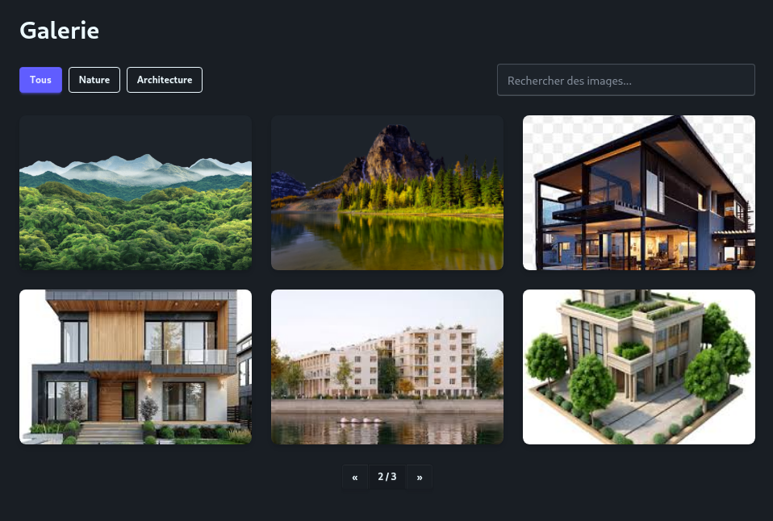

# Galerie d’images

Galerie d’images moderne réalisée avec **React**, **TypeScript**, **Tailwind CSS** et **daisyUI**.

## Fonctionnalités

- Affichage en **grille responsive**
- **Filtres** par catégorie (Nature / Architecture / Tous)
- **Recherche en temps réel** par titre
- **Pagination** simple
- **Hover effects** sur les images

## Installation

```bash
npm install
npm run dev
```

## Aperçu



- [Voir la démo en ligne](https://demo-link.com)
