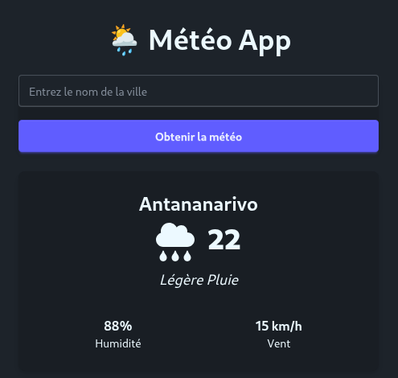

# 🌦️ Météo App

Une petite application React + TypeScript pour afficher la météo d'une ville en temps réel avec l'API OpenWeatherMap.  
Styling avec **Tailwind CSS** et **daisyUI**.

## Fonctionnalités

- Recherche de ville et affichage des infos météo : température, humidité, vent, description
- Ville par défaut affichée au chargement
- Loader pendant le chargement
- Icônes météo dynamiques
- Responsive et stylé avec Tailwind + daisyUI

## Installation

```bash
npm install
npm run dev
```

## Usage

Saisir une ville et cliquer sur "Obtenir la météo".
La météo s'affiche dans la carte

## Aperçu



- [Voir la démo en ligne](https://bootcamp-bice.vercel.app/)