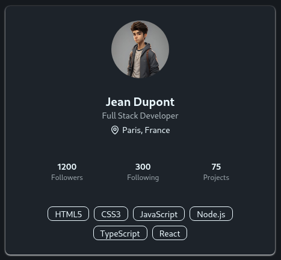

# 👤 Carte de Profil Utilisateur

Carte de profil utilisateur moderne et responsive en **React + TypeScript** (front-end uniquement, données mockées).

## ✨ Fonctionnalités
- Infos utilisateur (avatar, nom, rôle, localisation)
- Compétences, statistiques
- Responsive (desktop & mobile)

## 🚀 Démo
**https://usercard-coral.vercel.app/**

## 🖼️ Aperçu


## 🛠️ Stack
React · TypeScript · Vite · TailwindCSS · Lucide-react

## ▶️ Lancer le projet
```bash
npm install
npm run dev
```